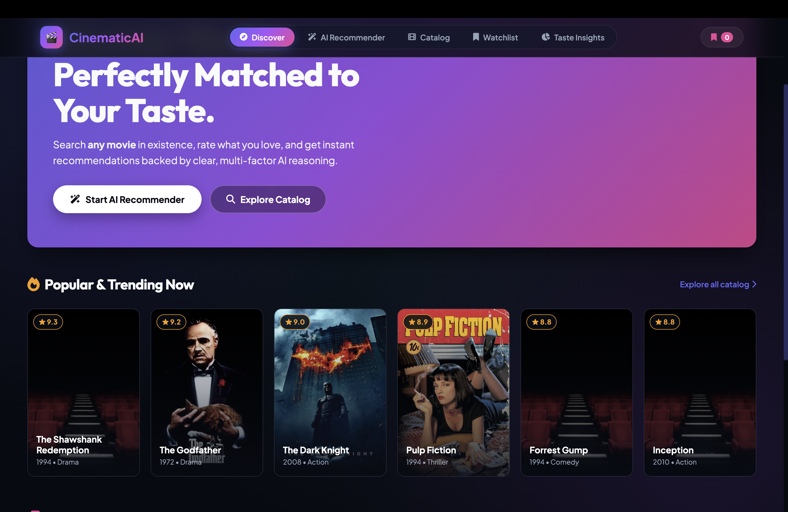
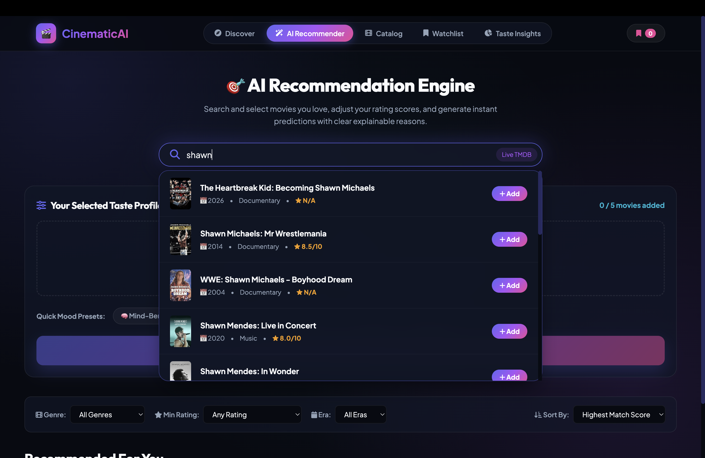

# 🎬 Movie Recommender System

A full-stack movie recommendation web app built for my machine learning project. It uses **Content-Based Filtering (TF-IDF + Cosine Similarity)** combined with the **TMDB API** to recommend movies based on your personal taste, rate your favorites, and explain _why_ each movie was recommended.

---

## 📸 Screenshots

### 1. Home / Discover Page



### 2. AI Recommender & Explainable Reasons



---

## ✨ Main Features

- 🔍 **Search Any Movie**: Live search connected to TMDB API (800,000+ movies).
- 🧠 **Smart Recommendations**: Uses TF-IDF vector similarity across genres, overviews, directors, keywords, and lead cast.
- 💡 **Explainable AI**: Shows clear reasons why each movie was recommended for you.
- 🎬 **Trailers & Cast Info**: Watch YouTube trailers and view director & lead cast details.
- 🔖 **Watchlist**: Bookmark movies to save them in your personal watchlist.
- 📊 **Taste Insights**: Interactive analytics showing your top preferred genres and rating habits.

---

## 🛠️ Tech Stack

- **Backend**: Python, FastAPI, Streamlit, Pandas, Scikit-Learn (TF-IDF), Requests
- **Frontend**: HTML5, Vanilla CSS3 (Dark Glassmorphism UI), JavaScript
- **Data & API**: TMDB (The Movie Database) API & Netflix Titles Dataset

---

## 🚀 Quickstart Guide

### 1. Clone & Set Up Virtual Environment

```bash
git clone https://github.com/YOUR_USERNAME/movie-recommender.git
cd movie-recommender

python3 -m venv .venv
source .venv/bin/activate
pip install -r requirements.txt
```

### 2. Set Up Environment Variables

```bash
cp .env.example .env
```

_(Optionally add your TMDB API key to `.env` if you have one)_

### 3. Launch the Web Application

```bash
python3 server.py
```

Open **`http://localhost:8000`** in your browser!

_(Or run the Streamlit version: `streamlit run app.py`)_

---

## 📊 Run Data Analysis Script

To run the Netflix data analysis and generate charts:

```bash
python3 analyzer.py
```

Generated charts will be saved inside the `visualizations/` folder.
